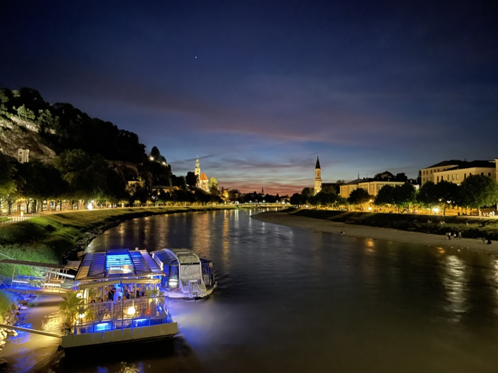

# Aarav Sharma — Personal Portfolio



A responsive personal portfolio website built with **HTML + Tailwind CSS** and hosted for free on **GitHub Pages** using a custom domain (`aaravtech.me`).

## 🌟 Features
- Light/dark theme toggle (persistent with localStorage)
- Sections for About, Experience, Projects, Skills, and Work Samples
- Responsive layout optimized for mobile & desktop
- Minimalist design with clean typography and Tailwind utility classes
- Free hosting via GitHub Pages

## 📂 Project Structure
```
index.html
assets/
 ├── resume.pdf
 ├── work-samples/
 │    └── final-research-report.pdf
 ├── interests/
 │    ├── hiking.jpg
 │    ├── photography.jpg
 │    └── traveling.jpg
 ├── work-samples.json
 └── site.css
README.md
```

## 🚀 Deployment
This site is live at **[https://aaravtech.me](https://aaravtech.me)** via GitHub Pages.

To update your site:
1. Edit or replace any files (e.g., resume, work samples, photos).
2. Commit changes to `main` branch — GitHub Pages will automatically redeploy.

If your domain stops showing updates:
- Hard refresh (`Cmd+Shift+R` or `Ctrl+Shift+R`)
- Check **Settings → Pages → Deployment logs**
- Ensure the repo root (not a subfolder) contains `index.html`

## 🛠️ Local Testing
Simply open `index.html` in your browser. No build step required.

## 📬 Contact
**Aarav Sharma**  
BS/MS Computer Science @ Georgia Tech  
📧 [aarav.sharma@gatech.edu](mailto:aarav.sharma@gatech.edu)  
🌐 [aaravtech.me](https://aaravtech.me) | [LinkedIn](https://www.linkedin.com/in/aaravsharma1) | [GitHub](https://github.com/AaravSharma1)
